# PRAKTIKUM 1

1. Buat sebuah database dengan nama latihan2!

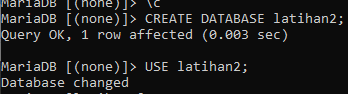

2. Buat sebuah tabel dengan nama biodata (nama, alamat) didalam database latihan2!

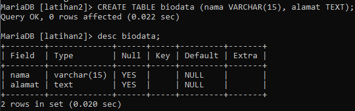

3. Tambahkan sebuah kolom keterangan (varchar(15), sebagai kolom terakhir!

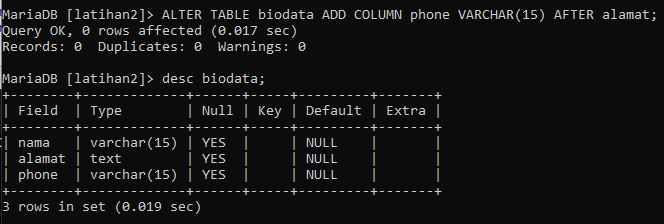

4. Tambahkan kolom id (int11) diawal (sebagai kolom pertama)!

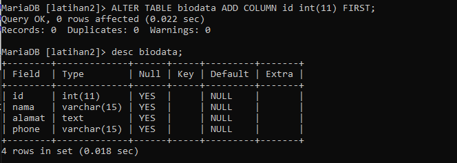

5. Sisipkan sebuah kolom dengan nama phone (varchar(15) setelah kolom alamat!

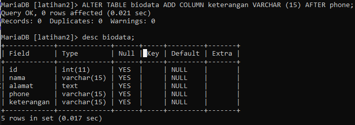

6. Ubah tipe data kolom id menjadi char(11)!

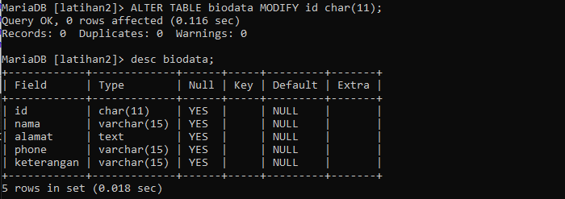

7. Ubah nama kolom phone menjadi hp (varchar(20)!

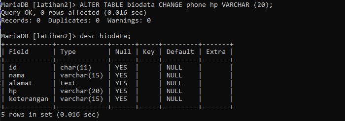

8. Tambahkan kolom email setelam kolom hp!

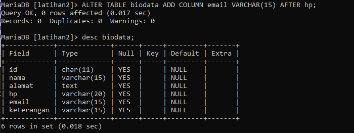

9. Hapus kolom keterangan dari tabel!

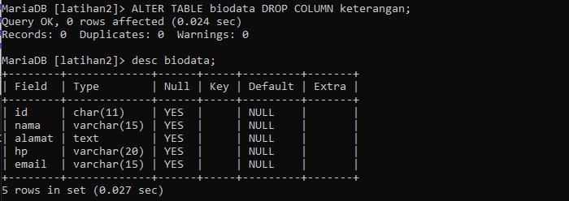

10. Ganti nama tabel menjadi data_mahasiswa!

11. Ganti nama field id menjadi nim!

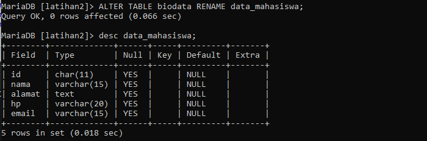

12. Jadikan nim sebagai PRIMARY KEY!

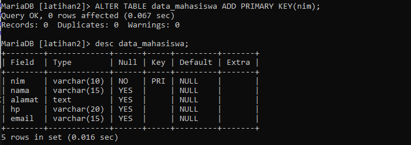

13. Jadikan kolom email sebagai UNIQUE KEY!

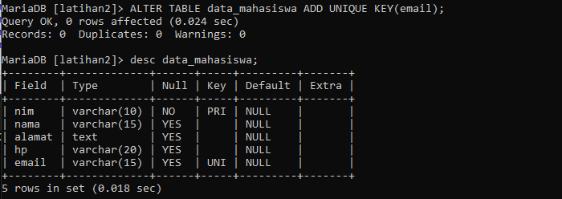
 
# Evaluasi dan Pertanyaan

1. Apa yang dimaksud dengan int(11)?

Yang dimaksud int(11) artinya suatu data yang dipakai atau digunakan menggunakan tipe data int atau integer dengan length atau panjang karakter 11.

2. Ketika kita melihat struktur tabel denga perintah desc, ada kolom Null berisi YES dan NO. apa maksudnya?

Apabila Null berisi no, maka data tersebut nantinya akan dilakukan pengisian atau penginputan. Sedangkan apabila Null berisi yes, maka artinya data tersebut akan dikosongkan atau tidak dilakukan penginputan.
